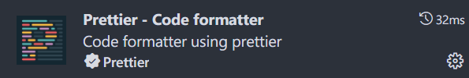

# VScode 的配置

## 安装 VScode

VScode 官网：[Visual Studio Code - Code Editing. Redefined](https://code.visualstudio.com/)

点击下载即可。

​

为保证权限充足，请不要从浏览器中直接打开安装包，而是从文件管理器中从右键打开。

​​

按默认设置安装即可。

## 安装必备插件

​​

​​

​​

## 安装 GNU Arm Embedded Toolchain 编译工具链

打开 "Embedded IDE" 插件面板，配置编译工具链，选择 "GNU Arm Embedded Toolchain" ，直接在线下载即可。

​​

## 安装开源调试工具 OpenOCD

​​

# 项目的导入与配置

## 使用 STM32CubeMX 导出工程

需要更改 STM32CubeMX 中的部分设置。

​​

​​

然后点击生成代码。

​​

工程就成功导出了。

​​

## 导入生成好的工程到 VScode

返回 VScode ，点击 “Import Project” ，选择 “Eclipse” 类型，选择生成代码中的 “.cproject” 文件。

​​

## 配置没有成功导入的部分

1. 配置 LinkerScript（绿色）
2. 把调试器改为 OpenOCD，选择自己的型号（绿色）
3. （若还是无法编译运行，则参考红色部分补充完整）

​​

​​

# 功能测试

## 编译和下载

​​

## 调试

​​

# 推荐的其他插件

​​

​​

​​

​​

​​

​​

​​

​​

​​

​​

​​

​​

​​

​​

​​

​​

​​

​​

‍

​​
